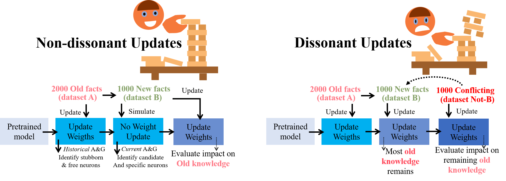
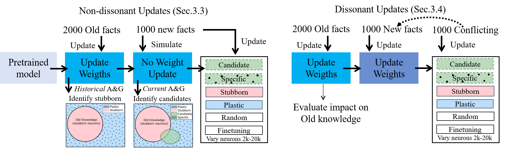
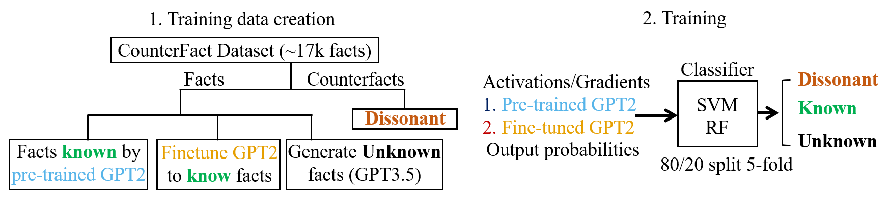
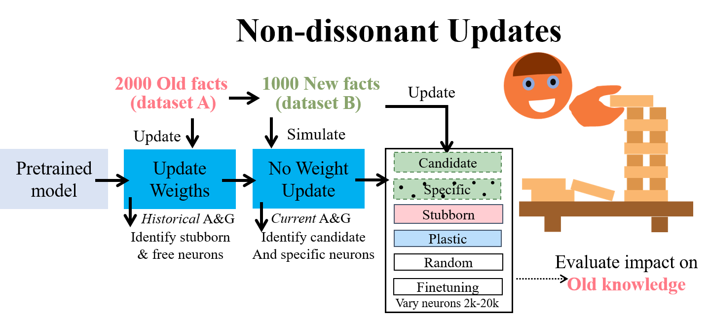
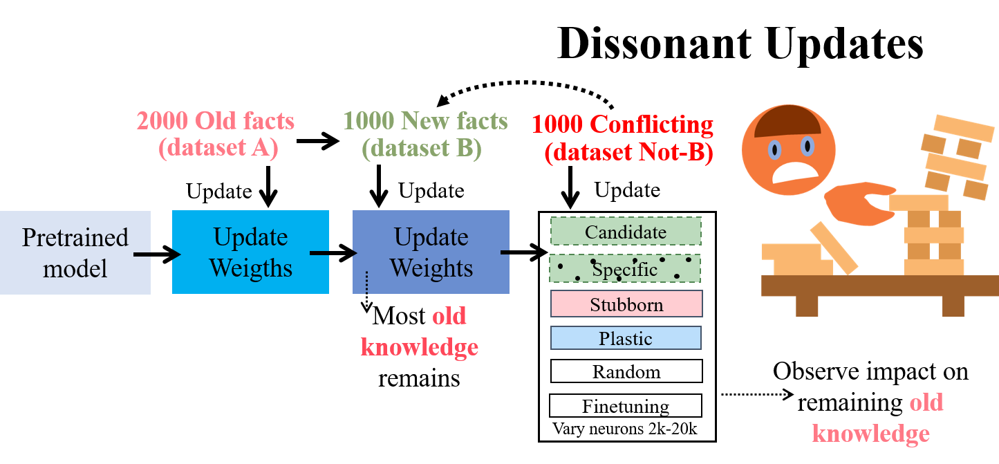

<div align="center">

# 🧠 In Praise of Stubbornness: The Case for Cognitive-Dissonance Aware Continual Update of Knowledge in LLMs

  [](https://arxiv.org/abs/2501.XXXXX) [](https://opensource.org/licenses/MIT)



</div>

> Just as humans rely on cognitive dissonance and stubbornness to protect valuable knowledge while learning new information, we show that LLMs need similar mechanisms. Our empirical investigation reveals that dissonant updates in Large Language Models (LLMs) catastrophically destroy prior (unrelated) knowledge, unlike non-dissonant ones which are relatively harmless. We show that it's possible to make LLMs aware of such conflicts through simple features - enabling targeted updates for non-dissonant learning and prevention of destructive updates for dissonant cases. These findings call for future human-inspired methods where knowledge isn't erased but rather transformed and contextualized (just as humans retained their old knowledge when learning that Pluto isn't a planet).

## Towards Continual Integration of Episodic Memories in LLMs
The long-term vision of this project is to develop methods for continually updating the world models of Large Language Models (LLMs), enabling them to incorporate episodic events, forming episodic memories - a crucial feature for future intelligent systems. This repository reports on our cognitively-inspired empirical investigations into how LLMs handle knowledge updates, focusing on the impact of dissonance and the selective updating of neural populations, on the preservation of old knowledge.

## 🔄 Dissonance-aware continual update of knowledge in LLMs - Experiment Instructions

<div align="center">

</div>

While our ultimate goal is to handle complex episodic events, this work takes a first step by focusing on factual updates, while avoiding catastrophic forgetting. In this exercice, we introduce and evaluate two main components:

1. Dissonance Awareness: Going beyond the classic novel/familiar split, we propose a tri-state classification of information as novel, familiar, or dissonant. This approach aims to identify conflicting information, inspired by human cognitive dissonance.

2. Targeted Network Updates: We explore various methods to selectively update specific neurons based on their historical usage (stubborn vs. plastic) and relevance to new information.

This repository contains code for reproducing our empirical studies, which evaluate:

- The feasibility of tri-state classification using activation and gradient features (in addition to output only features) [called experiment1 in the code]

- The effect of non-dissonant updates on preserving prior knowledge [called experiment2 in the code]

- The challenges posed by dissonant updates on preserving old knowledge [called experiment3 in the code]


### 📁 Repository Structure

```bash
├── analysis              # Jooks for analysis and plot generation
├── configs               # Configuration files for running experiments
├── dataset               # Datasets used for the experiments
├── EasyEdit_append       # Addition to the EasyEdit package in order to evaluate MEMIT and ROME
├── example_bash_scripts  # Some sample bash scripts to automate experiments
├── experiments           # Placeholder for all experiment results and updated models
├── experiments_scripts   # Contains scripts for each experiment
├── models                # Pre-trained models used for the experiments (to be downloaded)
├── results               # Folder for selected experiment results (e.g. used for plots)
├── useful_scripts        # Some useful scripts
└── utils                 # Utility functions used in the experiments
```


### ⚙️ Setup

```bash
conda env create -f environment.yml
conda activate dissonance
```


### download models

First, use the `download_models.py` script to download gpt2xl and gpt2small models necessary for the experiments (or place the models and their conf files under `./models/pt_models/gpt2-small` and `./models/pt_models/gpt2-xl` )

## 🤔 1. Dissonance awareness:


<div align="center">

</div>

### 1.1. Classification data preparation

The Counterfact dataset does not contain unknown facts. We hence generate data for such unknown class using GPT-3.5 (done before the advent of mini and 4o):
    - We use the prompt described in `datatset_generation/unknown_phrases_prompt.txt` to produce unknown facts inspired by the structure of the real ones (contained in file `dataset/facts/unknown_35.json`). 
    - After the synthetic data generation, we use `datatset_generation/expand_unknown_dataset.py` to modify the dataset structure in order to be compatible with the classification feature extraction loop. The processed "unknown" dataset will be located in `dataset/multi_counterfact_unknown.json`. 

### 1.2. Classification using activations and gradients

#### Step1: historical data extraction + training:

```bash
accelerate launch --config_file  configs/gpu_4.yaml experiments_scripts/experiment_1_1.py --config configs/[model_name]_experiment1_1.yml
```

#### Step2: *current* feature extraction + classification:

```bash
python experiments_scripts/experiment_1_1_class.py --config configs/[model_name]_experiment1_1.yml

```

The config file used for the papers is `./configs/gpt2-small_experiment1_1_ft_ablation.yml`

### 1.3. Classification using model output only (as opposed to activations and gradients)

In addition to feasibility with activations and gradients above, we tested also using model output probabilities. The corresponding experiment can be ran exactly as follows.

```bash
python experiments_scripts/exp_1_1_output_only.py --config configs/gpt2-small_experiment1_1_output_only.yml

```

## 📊 2. Non-dissonant updates

### Experiment 2.1: Targetted updates comparing different placement strategies

<div align="center">

</div>

This script trains the model `model_name` on old (dataset A in the script) and new (dataset B) knowledge, using different placement strategies, with experiment parameters defined in the corresponding config file. The results in the paper for gpt2-small were ran with this script:

```bash
accelerate launch --config_file configs/gpu_3.yaml experiments_scripts/exp_2_1_with_LoRa.py --config configs/gpt2-small_experiment2_1.yml
```  

Adapt `--config_file configs/gpu_3.yaml` to suit your particular setting.

We experimented with gpt2-small and gpt2-xl under various conditions. Example of config files we used are available under `./configs/gpt2*2_1*`
The results are always stored in a timestamped file under `experiments/[model_name]/[experiment_name]`. Note, for completeness, that for certain experiments, we manually moved the json file of the results to ../results/[experiment_name] where the timestamp was stripped off (e.g. `results/experiment_2_1/experiment_2_1_paper_version_LoRA.json` is the same file as `experiments/gpt2-small/experiment_2_1/results/experiment_2_1_paper_version_LoRA_20241206_121141.json`). 


### Experiment 2.2: Lottery ticket hypothesis (appendix)

In this experiment, we train on an unrelated dataset H, to identify the winning subnetworks (neurons that changed a lot during the training on H). We then start from a pre-trained model and assess the efficiency of the winning subnetworks in learning new knowledge. The lottery ticket script is `exp_2_2.py`. Paper results were obtained by running:

```bash
accelerate launch --config_file configs/gpu_4.yaml configs/gpt2-small_experiment2_2.yml --config experiments_scripts/exp_2_2.py
```

## 💥 3. Dissonant updates

### Experiment 3.1: comparing different placement strategies

<div align="center">

</div>

In this experiment, as shown in the figure, we sequentially train: 

`old facts (dataset A) => new facts (dataset B) => Counterfacts (counterfact(B))`. To run dissonant update experiments, we can do the following:

```bash
accelerate launch --config_file  configs/[model_name]_experiment3_1.json experiments_scripts/exp_3_1_withLoRa.py
```

- To reproduce paper results, with GPT2-small, we used `exp_3_1_with_LoRa.py`:

```bash
accelerate launch --config_file  configs/gpt2-small_experiment3_1_iclr_submitted.yml experiments_scripts/exp_3_1_with_LoRa.py
```

The results can be found in `results/experiment_3_1/experiment_3_1_paper_version_LoRA_submitted_conf.json`

- GPT2-xl experiments were ran using `exp_3_1_xl.py`. An example:

```bash
accelerate launch experiments_scripts/exp_3_1_xl.py --config configs/gpt2-xl_experiment3_1_2000_1000_10_small_lr.yml
```

`example_bash_scripts/gpt2xl_experiments_3_1.sh` contains full list of XL experiments whose results are in `./experiments/gpt2-xl/experiment_3_1`. You can follow the visualization notebooks below for more information.

#### Note
Not mentioned in the paper, but useful as control and sanity check test, we train on a non-dissonant dataset C:

`old facts (dataset A) => new facts (dataset B) => new facts (Dataset(C))` 

This allowed us to appreciate through a different mean the higher degradation in performance in case of non-dissonant updates compared to dissonant ones.


## 🔧 4. Easyedit based experiments to compare with ROME and MEMIT

See the readme in the  `./EasyEdit_append` folder for instructions on how to run the ROME and MEMIT comparisons.

## 📈 5. Self-explained Visualizations

All plots and visualizations are in the corresponding notebooks under `./analysis`. The visualization notebooks follow the same names as the experiment scripts.

### 5.1. Dissonance awareness:

- `analysis/plots_exp_1_finetuned_model.ipynb`: Learning from the internal features of a finetuned model. 
- `analysis/plots_exp_1_pretrained_model.ipynb`: Learning from the internal features of a pretrained model. 
- `analysis/plots_exp_1_model_output_only.ipynb`: Learning from model outputs.  
- `analysis/plots_exp_1_featAnalysis.ipynb`: Analysis of features across blocks.

### 5.2. Non-dissonant updates:

- `analysis/plots_exp_2_1.ipynb` : To analyze the results of non-dissonant updates for gpt2-small.
- `analysis/plots_exp_2_1_xl.ipynb`: : To analyze the results of non-dissonant updates for gpt2-XL and visualize stubborn and plastic neurons.
- `analysis/plots_exp_2_1_xl_with_gpt2small.ipynb`: for opposing both gpt2small and XL.

### 5.3. Dissonant updates:

- `analysis/plots_exp_3_1.ipynb`: dissonant updates on gpt2-small
- `analysis/plots_exp_3_1_xl.ipynb`: dissonant updates on gpt2-xl (reported in the paper)
- `analysis/plots_exp_3_1_xl__Addendum_LR_impact_illustration.ipynb`: To observe impact of scaling/visualize the challenges of ingesting knowledge in a larger model.

## 📈 6. Interesting novel observations warranting further investigation:

Not reported in the paper, we added a couple of notebooks revealing interesting observations warranting future investigations.

### 6.1. The ratio between old vs new learning rates matter

The analysis can be seen in the `analysis/plots_exp_2_1_Addendum_LR_impact_illustration.ipynb`  notebook.

### 6.2. Dissonant information needs double more epochs to be ingested compared to non-dissonant information

The analysis can be seen in the `analysis/plots_exp_3_1_Addendum_epochs_illustration.ipynb` notebook.

#### Note on other experiments
We performed other ablations which did not make it to the final paper (experiments 2.3, 3.2, 3.3 and 3.3 bonus). 

## 🛠️ Utilities used by the various scripts

- **paramaters_hooks**: Hooks for extracting activation and gradient features from models.
- **utils_gen**: General functions (including older functions).
- **utils_ft**: Functions related to fine-tuning.
- **utils_load**: Loaders for datasets.
- **utils_evaluate**: Evaluation functions.
- **utils_classification**: Feature extraction and classification functions.


## 📜 Citation

```bibtex
@article{2024dissonancellm,
  title={In Praise of Stubbornness: The Case for Cognitive-Dissonance Aware Continual Update of Knowledge in LLMs},
  author={Clemente, Simone and Ben Houidi, Zied and Huet, Alexis and Rossi, Dario and Franzese, Giulio and Michiardi, Pietro},
  journal={arXiv preprint arXiv:2501.XXXXX},
  year={2025}
}
```

## 📄 License

MIT License - see [LICENSE](LICENSE) for details.