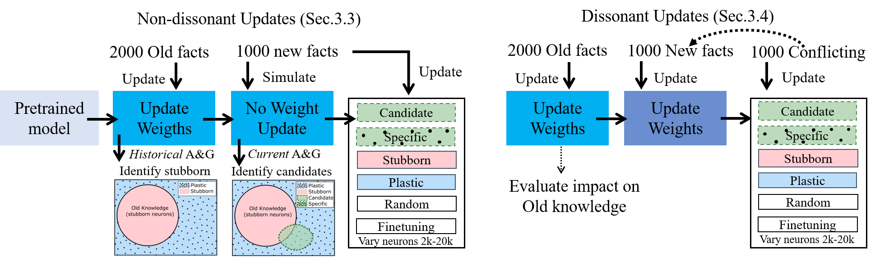
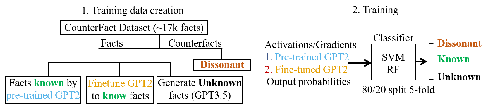

<div align="center">
  <h1>Towards Building Episodic Memories in LLMs</h1>
  <h2>In Praise of Stubbornness: The Case for Cognitive-Dissonance Aware Continual Update of Knowledge in LLMs</h2>
</div>

The long-term vision of this project is to develop methods for continually updating the world models of Large Language Models (LLMs), enabling them to incorporate episodic events, forming episodic memories - a crucial feature for future intelligent systems. This repository reports on our cognitively-inspired empirical investigations into how LLMs handle knowledge updates, focusing on the impact of dissonance and the selective updating of neural populations, on the preservation of old knowledge.

## Dissonance-aware continual update of knowledge in LLMs - Experiment Instructions



While our ultimate goal is to handle complex episodic events, this work takes a first step by focusing on factual updates, while avoiding catastrophic forgetting. In this exercice, we introduce and evaluate two main components:

1. Dissonance Awareness: Going beyond the classic novel/familiar split, we propose a tri-state classification of information as novel, familiar, or dissonant. This approach aims to identify conflicting information, inspired by human cognitive dissonance.

2. Targeted Network Updates: We explore various methods to selectively update specific neurons based on their historical usage (stubborn vs. plastic) and relevance to new information.

This repository contains code for reproducing our empirical studies, which evaluate:

- The feasibility of tri-state classification using activation and gradient features (in addition to output only features)

- The effect of non-dissonant updates on preserving prior knowledge

- The challenges posed by dissonant updates on preserving old knowledge

The experiments are described in the paper **"In praise of stubbornness: The Case for Cognitive-Dissonance Aware Continual Update of Knowledge in LLMs"**. The experiments are organized into different scripts, each corresponding to a specific experiment in the study.

### Repository Structure

```bash
├── analysis              # Jooks for analysis and plot generation
├── configs               # Configuration files for running experiments
├── dataset               # Datasets used for the experiments
├── EasyEdit_append       # Addition to the EasyEdit package in order to evaluate MEMIT and ROME
├── example_bash_scripts  # Some sample bash scripts to automate experiments
├── experiments           # Placeholder for experiment results and updated models
├── experiments_scripts   # Contains scripts for each experiment
├── models                # Pre-trained models used for the experiments (to be downloaded)
├── results               # Folder for saving experiment results
├── useful_scripts        # Some useful scripts
└── utils                 # Utility functions used in the experiments
```

### Requirements

- **Python**: 3.8 or higher
- **accelerate**: Library for distributed training
- **torch** and **transformers**: Libraries for model handling
- Additional Python packages listed in [`requirements.txt`](./requirements.txt)

### download models

First, use the `download_models.py` script to download gpt2xl and gpt2small models necessary for the experiments (or place the models and their conf files under `./models/pt_models/gpt2-small` and `./models/pt_models/gpt2-xl` )

## 1. Dissonance awareness:



### Classification data preparation

The Counterfact dataset does not contain unknown facts. We hence generate data for such unknown class using GPT-3.5 (done before the advent of mini and 4o):
    - We use the prompt described in `datatset_generation/unknown_phrases_prompt.txt` to produce unknown facts inspired by the structure of the real ones (contained in file `dataset/facts/unknown_35.json`). 
    - After the synthetic data generation, we use `datatset_generation/expand_unknown_dataset.py` to modify the dataset structure in order to be compatible with the classification feature extraction loop. The processed "unknown" dataset will be located in `dataset/multi_counterfact_unknown.json`. 

### Experiment 1.1 : historical data extraction + training:

```bash
accelerate launch --config_file [accelerate file] experiments_scripts/experiment_1_1.py --config configs/[model_name]_experiment1_1.yml
```

### Experiment 1.2: current feature extraction + classification:

```bash
python experiments_scripts/experiment_1_1_class.py --config configs/[model_name]_experiment1_1.yml

```

The config file used for the papers is `./configs/gpt2-small_experiment1_1_ft_ablation.yml`

### Additional Experiment : Using model output only (as opposed to activations and gradients)

In addition to feasibility with activations and gradients, we tested also using model output probabilities. The corresponding experiment can be ran as follows.

```bash
python experiments_scripts/exp_1_1_output_only.py --config configs/gpt2-small_experiment1_1_output_only.yml

```


## 2. Non-dissonant updates

### Experiment 2.1: Targetted updates

```bash
accelerate launch --config_file  configs/[model_name]_experiment2_1_with_B.yml experiments_scripts/exp_2_1_withB.py
```

We experimented with gpt2-small and gpt2-xl under various conditions. All config files are available under `./configs/gpt2*2_1_withB*`

### Experiment 2.2: Lottery ticket hypothesis (appendix)

```bash
accelerate launch --config_file  configs/[model_name]_experiment2_2.yml experiments_scripts/exp_2_2.py
```

## 3. Dissonant updates

### Experiment 3.1

```bash
accelerate launch --config_file  configs/[model_name]_experiment3_1 experiments_scripts/exp_3_1.py
```

## Visualizations

All plots and visualizations are in the corresponding notebooks under `./analysis`
The notebook names follow the same names as the experiments.

## Note on other experiments
We performed other ablations which did not make it to the final paper (experiments 2.3, 3.2, 3.3 and 3.3 bonus). 

## Utilities used by the various scripts

- **paramaters_hooks**: Hooks for extracting activation and gradient features from models.
- **utils_gen**: General functions (including older functions).
- **utils_ft**: Functions related to fine-tuning.
- **utils_load**: Loaders for datasets.
- **utils_evaluate**: Evaluation functions.
- **utils_classification**: Feature extraction and classification functions.

## 4. Easyedit based experiments to compare with ROME and MEMIT

See the readme in the  `./EasyEdit_append` folder for instructions on how to run the ROME and MEMIT comparisons.
